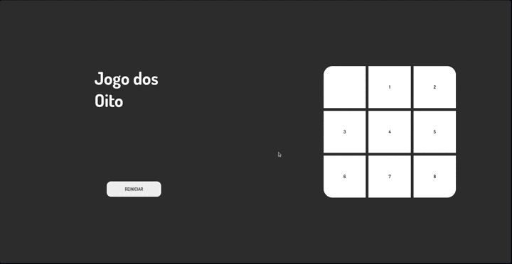

# Desafio utilizando Typescript, HTML e CSS

Esse é o resultado do desafio utilizando Typescript, HTML, CSS e POO.

&nbsp;

## Como executar ?

Navegue para a pasta

```bash
  cd jogo-oito/typescript/src
```

Inicie o servidor

```bash
  npx live-server
```

#### ou

Instale a extensão live server no seu vscode

```bash
  ctrl + P
```

```bash
  ext install ritwickdey.LiveServer
```

&nbsp;

## Check-list

- [ x ] Criar HTML

  - [ x ] Adicionar fonte (https://fonts.google.com/specimen/Dosis?query=dosis)

- [ x ] Adicionar CSS

  - [ x ] Adicionar parte estrutural
  - [ x ] Adicionar parte visual
  - [ x ] Adicionar responsividade
  - [ x ] Adicionar animações

- [ x ] Adicionar Typescript
  - [ x ] Renderizar números
  - [ x ] Adicionar Drag & Drop
  - [ x ] Trocar local do elemento após drop
  - [ x ] Inicializar animações de Grow effect
  - [ x ] Validar conteúdo do container para verificar se jogador ganhou o jogo

## Demonstração


